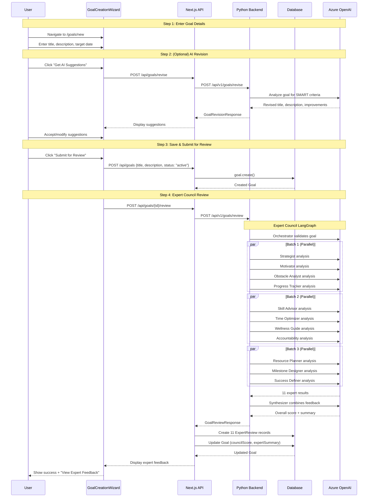
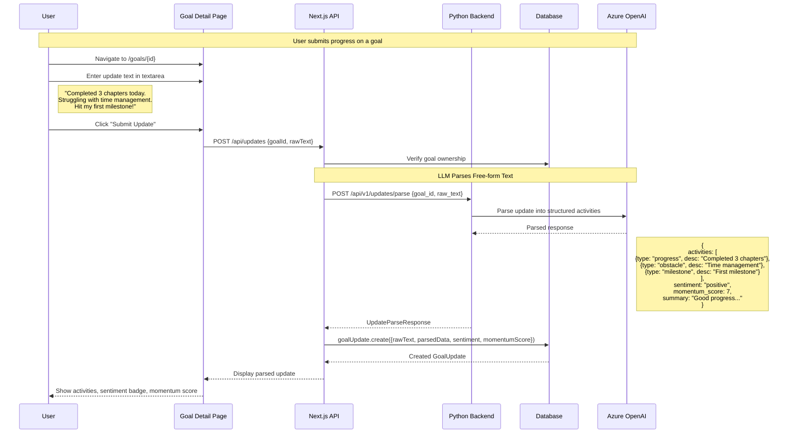

# Goal Creation & Progress Tracking Sequence Diagrams

## Overview
These diagrams show the complete user journey for:
1. Creating their first goals
2. Getting AI-powered expert review
3. Submitting progress updates
4. Daily activity logging for team metrics

---

## 1. Goal Creation Flow



---

## 2. Progress Update Flow



---

## 3. Daily Activity Logging (Team Metrics)

```mermaid
sequenceDiagram
    participant U as User
    participant UI as Daily Update Form
    participant API as Next.js API
    participant DB as Database

    Note over U,DB: Morning Check-in
    U->>UI: Navigate to daily update
    U->>UI: Select period: "morning"
    U->>UI: Enter activity text
    Note right of U: "Led a product demo for the new<br/>feature. Mentored 2 junior devs.<br/>Ran an A/B experiment on checkout."

    U->>UI: Click "Submit"
    UI->>API: POST /api/daily-updates
    Note right of UI: {<br/>  goalSetId,<br/>  updateText,<br/>  updatePeriod: "morning",<br/>  periodDate: "2026-01-27"<br/>}

    API->>DB: Check for duplicate (same period/date)

    API->>DB: dailyUpdate.create({updateText, updatePeriod, periodDate})
    DB-->>API: Created DailyUpdate

    Note over API,DB: Extract Activities for Metrics
    API->>DB: extractedActivity.createMany([<br/>  {type: "product_demos", quantity: 1},<br/>  {type: "mentoring", quantity: 2},<br/>  {type: "experiments", quantity: 1}<br/>])

    Note over API,DB: Update User Streak
    API->>DB: Get user.streakLastUpdate

    alt Same day update
        Note over API: No streak change
    else Consecutive day
        API->>DB: user.update({streakCurrent: +1})
    else Gap > 1 day
        API->>DB: user.update({streakCurrent: 1})
    end

    API->>DB: user.update({totalPoints: +20, streakLastUpdate: now})
    DB-->>API: Updated User

    API-->>UI: Success response
    UI-->>U: Show confirmation + streak status

    Note over U,DB: Achievement Check (Async)
    UI->>API: POST /api/achievements (check for new)
    API->>DB: Get user's activity counts
    API->>DB: Get unearned achievements

    loop For each unearned achievement
        alt Activity achievement met
            Note over API: e.g., "Log 50 experiments"
            API->>DB: userAchievement.create()
            API->>DB: user.update({totalPoints: +achievement.points})
        else Streak achievement met
            Note over API: e.g., "7-day streak"
            API->>DB: userAchievement.create()
        end
    end

    API-->>UI: New achievements earned
    UI-->>U: Show achievement notification 🏆
```



---

## 4. Complete User Journey (Combined)

```mermaid
sequenceDiagram
    participant U as User
    participant Next as Next.js App
    participant PY as Python Backend
    participant DB as Database
    participant LLM as Azure OpenAI

    rect rgb(240, 248, 255)
        Note over U,LLM: 🎯 GOAL CREATION
        U->>Next: Create new goal
        Next->>PY: Get AI suggestions (optional)
        PY->>LLM: Revise for SMART criteria
        LLM-->>Next: Improved goal
        Next->>DB: Save goal

        Next->>PY: Submit for Expert Review
        PY->>LLM: 11 experts analyze (3 parallel batches)
        LLM-->>PY: Expert feedback + scores
        PY-->>Next: Council review response
        Next->>DB: Save 11 ExpertReview records
    end

    rect rgb(255, 248, 240)
        Note over U,LLM: 📊 PROGRESS UPDATES
        U->>Next: Submit progress update (free text)
        Next->>PY: Parse update text
        PY->>LLM: Extract activities, sentiment, momentum
        LLM-->>Next: Structured data
        Next->>DB: Save GoalUpdate with parsed data
    end

    rect rgb(240, 255, 240)
        Note over U,LLM: 📅 DAILY ACTIVITY LOG
        U->>Next: Log daily activities
        Note right of U: experiments, demos,<br/>mentoring, presentations,<br/>volunteering
        Next->>DB: Save DailyUpdate
        Next->>DB: Create ExtractedActivity records
        Next->>DB: Update streak + points
        Next->>DB: Check & award achievements
    end

    rect rgb(255, 240, 255)
        Note over U,LLM: 🏆 GAMIFICATION
        Next->>DB: Query activity totals
        Next->>DB: Check achievement criteria
        Next-->>U: Award badges, update leaderboard
    end
```



---

## Activity Types Tracked

| Activity Type | Description | Example Achievement |
|---------------|-------------|---------------------|
| `experiments` | A/B tests, innovation work, hypothesis testing | "Log 50 experiments" |
| `product_demos` | Product demonstrations, pitch sessions | "Complete 25 product demos" |
| `mentoring` | One-on-one mentoring, coaching sessions | "Complete 20 mentoring sessions" |
| `presentations` | Talks, webinars, conference presentations | "Give 15 presentations" |
| `volunteering` | Volunteer work, community service | "Complete 15 volunteering activities" |

---

## Data Flow Summary

```
User Input                    Processing                      Storage
─────────────────────────────────────────────────────────────────────────
Goal title/description   →    AI Revision (optional)    →    Goal table
                         →    Expert Council (11 LLM)   →    ExpertReview table

Progress update text     →    LLM parses activities     →    GoalUpdate table
                                                              (raw + parsed JSON)

Daily activity log       →    Activity extraction       →    DailyUpdate table
                         →    Streak calculation        →    ExtractedActivity table
                         →    Achievement check         →    User (streak, points)
                                                              UserAchievement table
```
